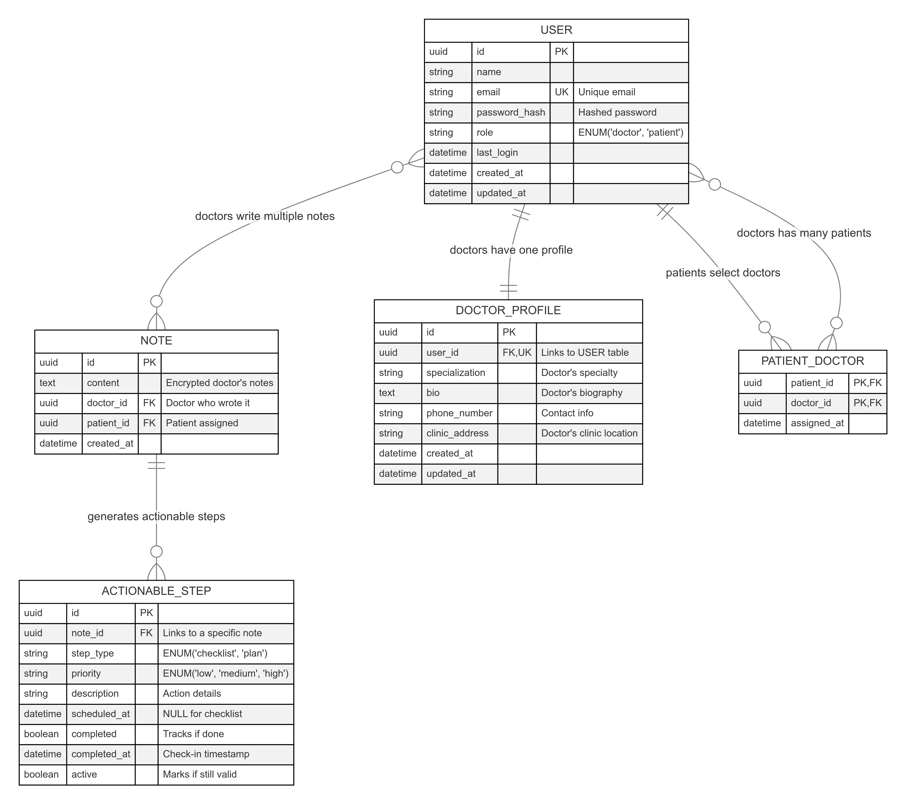

# Hospital Backend System

<!--toc:start-->
- [Hospital Backend System](#hospital-backend-system)
  - [Project structure](#project-structure)
  - [Database ERD](#database-erd)
  - [API Endpoints](#api-endpoints)
  - [Project Setup](#project-setup)
    - [Prerequisites](#prerequisites)
    - [Setting up the development environment](#setting-up-the-development-environment)
    - [Running the Application](#running-the-application)
<!--toc:end-->

## Project structure

```bash
hospital_backend_system/
│── app/
│   ├── core/                # Core configurations
│   │   ├── config.py        # Environment variables & settings
│   │   ├── database.py      # SQLModel DB setup
│   │   ├── security.py      # Password hashing & JWT auth
│   ├── models/              # SQLModel database models
│   │   ├── user.py          # User (Doctor/Patient) model
│   │   ├── note.py          # Doctor notes & encryption
│   │   ├── action.py        # Actionable steps & scheduling
│   ├── schemas/             # Pydantic (SQLModel) schemas
│   │   ├── user.py          # User request/response schemas
│   │   ├── note.py          # Note submission schemas
│   │   ├── action.py        # Actionable step schemas
│   ├── services/            # Business logic
│   │   ├── auth.py          # JWT authentication
│   │   ├── encryption.py    # Note encryption utilities
│   │   ├── llm_processor.py # LLM integration (Google Gemini/OpenAI)
│   │   ├── scheduler.py     # Celery background tasks
│   ├── routers/             # API routes (versioned)
│   │   ├── v1/              # API version 1
│   │   │   ├── auth.py      # Signup/Login routes
│   │   │   ├── doctors.py   # Doctor-related routes
│   │   │   ├── patients.py  # Patient-related routes
│   │   │   ├── notes.py     # Doctor notes API
│   ├── main.py              # FastAPI entry point
│   ├── exceptions.py        # Custom exceptions
│── migrations/              # Alembic migrations (for SQLModel)
│── tests/                   # Model and API tests
│── worker.py                # Celery worker for scheduling
├── setup_dev_db.sh          # Script to setup development database
├── setup_test_db.sh         # Script to setup test database
├── teardown_dev_db.sh       # Script to tear down development database
├── teardown_test_db.sh      # Script to tear down test database
│── .env                     # Environment variables
│── requirements.txt         # Dependencies
│── README.md                # Documentation
```

## Database ERD



## API Endpoints

| Category                   | Method | Endpoint                     | Description |
|----------------------------|--------|------------------------------|-------------|
| **Authentication**         | POST   | /api/v1/auth/signup          | Register a new user (doctor or patient) |
|                            | POST   | /api/v1/auth/login           | Authenticate and obtain access token |
|                            | GET    | /api/v1/auth/me              | Retrieve logged-in user details |
|                            | PUT    | /api/v1/auth/me              | Update logged-in user profile |
|                            | POST   | /api/v1/auth/logout          | Log out current user |
| **Doctor Profile Management** | GET    | /api/v1/me/profile           | Retrieve logged-in doctor’s profile |
|                            | PUT    | /api/v1/me/profile           | Update logged-in doctor’s profile |
| **Patient-Doctor Selection** | GET    | /api/v1/doctors              | List all available doctors |
|                            | POST   | /api/v1/me/doctors           | Select doctors as a patient |
|                            | POST   | /api/v1/me/doctors/remove           | Remove selected doctors as a patient |
|                            | GET    | /api/v1/me/doctors           | Retrieve patient’s selected doctors |
|                            | GET    | /api/v1/doctors           | Retrieve all the doctors available |
|                            | GET    | /api/v1/me/patients          | Retrieve list of patients assigned to the doctor |
| **Doctor Notes**           | POST   | /api/v1/notes                | Submit a new doctor’s note for a patient |
|                            | GET    | /api/v1/patients/{patient_id}/notes | Retrieve all notes for a patient |
| **Actionable Steps & Reminders** | GET    | /api/v1/me/actionable-steps  | Retrieve actionable steps for logged-in user |
|                            | GET    | /api/v1/patients/{patient_id}/actionable-steps | Retrieve actionable steps for a patient |
|                            | GET    | /api/v1/patients/{patient_id}/actionable-steps/complete | Mark step as complete for a patient |

## Project Setup

### Prerequisites

- Python 3.13.x
- PostgreSQL
- Redis

### Setting up the development environment

1. Clone the repository

    ```bash
    git clone https://github.com/nanafox/hospital_backend_system

    # change directory into the project directory
    cd hospital_backend_system
    ```

2. Create a virtual environment

    ```bash
    python3 -m venv .venv
    source .venv/bin/activate  # On Windows: .venv\Scripts\activate
    ```

3. Install dependencies

    ```bash
        pip install -r requirements.txt
    ```

4. Add the required environment variables in the `.env` file.
   See `.env.template` for the required variables

   **Note:** You can use the following to generate the secret and encryption
   keys.

   ```bash
   python -c "import secrets; print(secrets.token_urlsafe(32))"
   ```

5. If on a Linux-based system, run the following to setup the database

    ```bash
    ./setup_dev_db.sh
    # For Windows users, simply create the database and continue
    ```

### Running the Application

1. Start the server

    ```bash
    fastapi dev
    ```

2. Access the API Documentation

    - Swagger UI (Interactive): <http://localhost:8000/api/swagger-docs>
    - ReDoc (Static Docs): <http://localhost:8000/api/docs>
